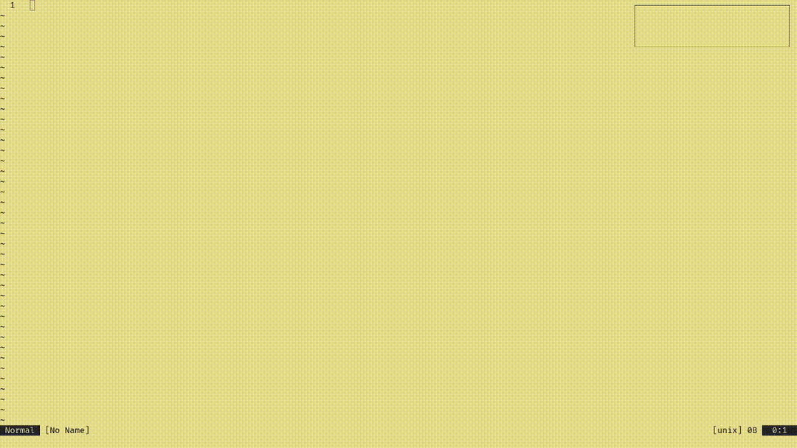

# minesweeper.nvim

*A Neovim Plugin that provides a text-based minesweeper game.*



**Features:**

* Play Minesweeper directly within Neovim.
* Customizable game board size and number of mines.
* Simple keybindings for gameplay.
* To win, you need to cover all `bombs` on the board with `flags`.

**Dependencies:**

* `leonardo-luz/floatwindow.nvim`

**Installation:**  Add `leonardo-luz/minesweeper.nvim` to your Neovim plugin manager (e.g., `init.lua` or `plugins/minesweeper.lua`).

```lua
{ 
    'leonardo-luz/minesweeper.nvim',
    dependencies = {
      {
        'leonardo-luz/floatwindow.nvim',
      },
    },
    opts = {
      map_size = { x = 30, y = 16 }, -- Board dimensions (x, y). default: { x = 30, y = 16 }
      max_bombs = 50, -- Maximum number of mines. default: 50
      highlight_flags_around = false, -- Highlights flags around cursor when enabled. default: false
    },
}
```

**Usage:**

* `:Minesweeper` to start the game.
* normal mode, `q` or `<esc><esc>`: Quit
* normal mode, `x`: Uncover current tile
* normal mode, `f`: Place/remove a flag, 

## Contributing

Contributions are welcome! If you'd like to help improve `minesweeper.nvim`, feel free to **open issues** or **pull requests**.
